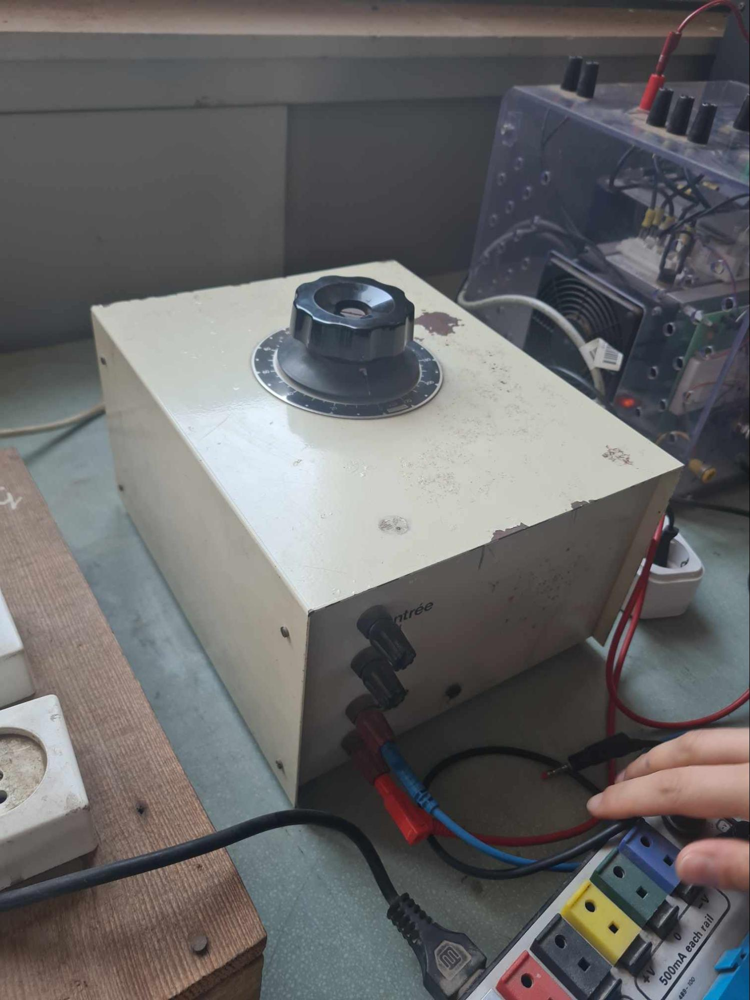
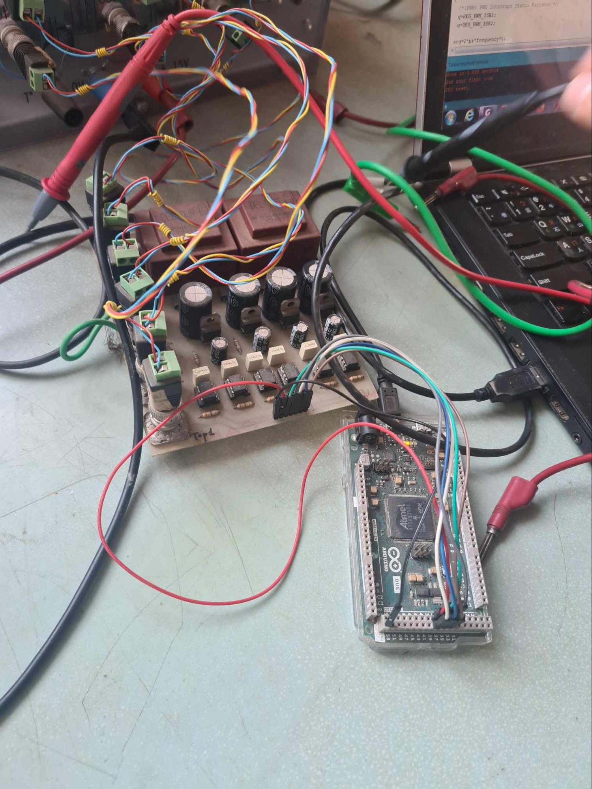
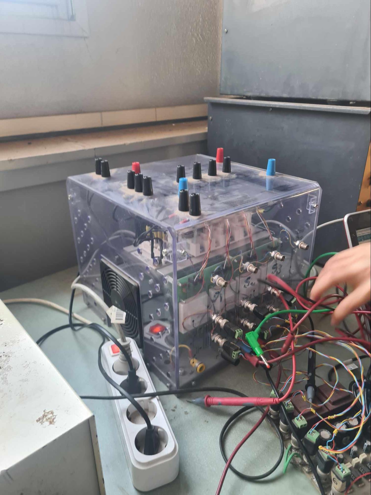
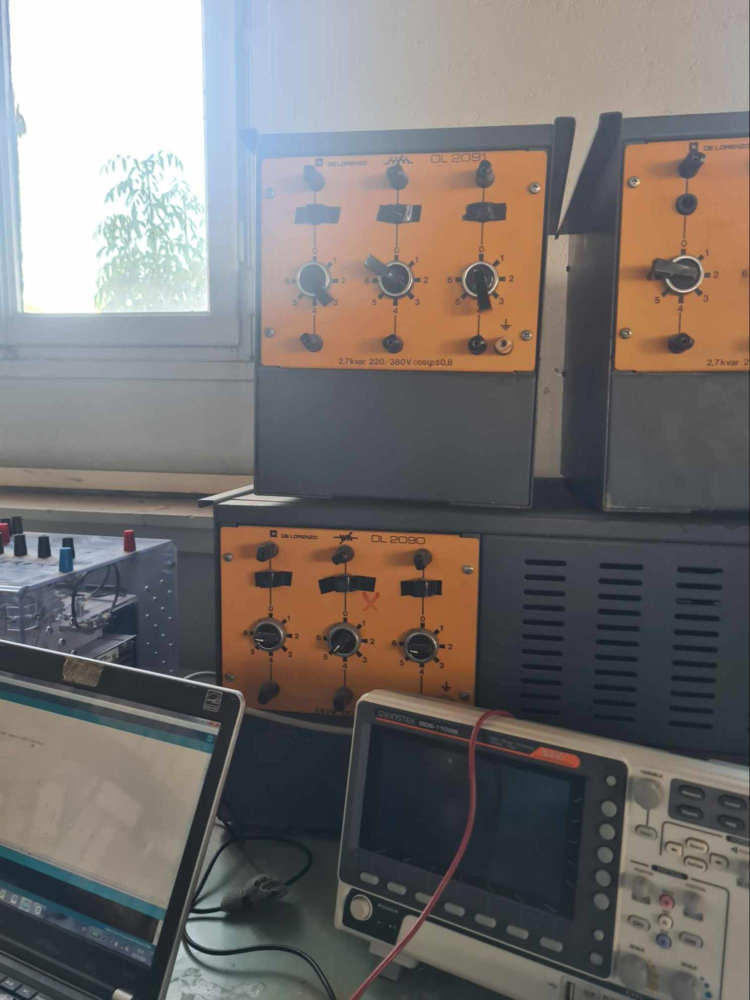
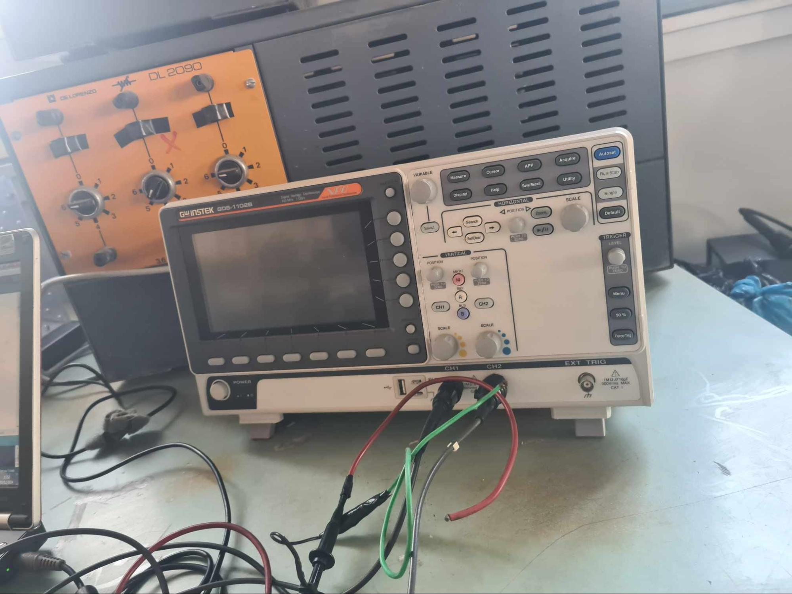

<h2>Project Description</h2>

  This practical work focuses on the study and analysis of the performance of
  two types of inverter configurations: <strong>single-phase and three-phase
  inverters</strong>. Several control techniques are investigated, including
  <strong>square-wave (full-wave) control, phase-shifted control, and Pulse
  Width Modulation (PWM)</strong>.

  The practical study examines the operation of these control methods and
  their influence on the characteristics and quality of the generated AC
  voltage.

<h2>Objectives</h2>

The main objectives of this practical work are to:

<ul>
  <li>
    Experimentally study the performance of
    <strong>three-phase inverters</strong> and their
    different modulation techniques.
  </li>
  <li>
    Understand the operating principles of the investigated control methods.
  </li>
  <li>
    Analyze their influence on the <strong>quality of the generated AC voltage</strong>.
  </li>
  <li>
    Evaluate the impact of the different modulation techniques on the overall
    <strong>performance of the inverter system</strong>.
  </li>
</ul>
<table>
  <thead>
    <tr>
      <th>Equipment</th>
      <th>Image</th>
    </tr>
  </thead>
  <tbody>
    <tr>
      <td>DC Voltage Source</td>
      <td>
        
      </td>
    </tr>
    <tr>
      <td>Driver and Arduino Uno Board</td>
      <td>
        
      </td>
    </tr>
    <tr>
      <td>Inverter Setup</td>
      <td>
        
      </td>
    </tr>
    <tr>
      <td>RL Load</td>
      <td>
        
      </td>
    </tr>
    <tr>
      <td>Oscilloscope</td>
      <td>
        
      </td>
    </tr>
  </tbody>
</table>
