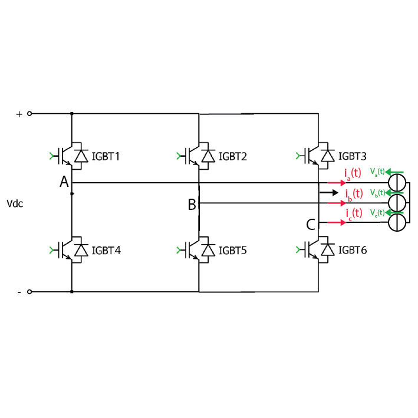
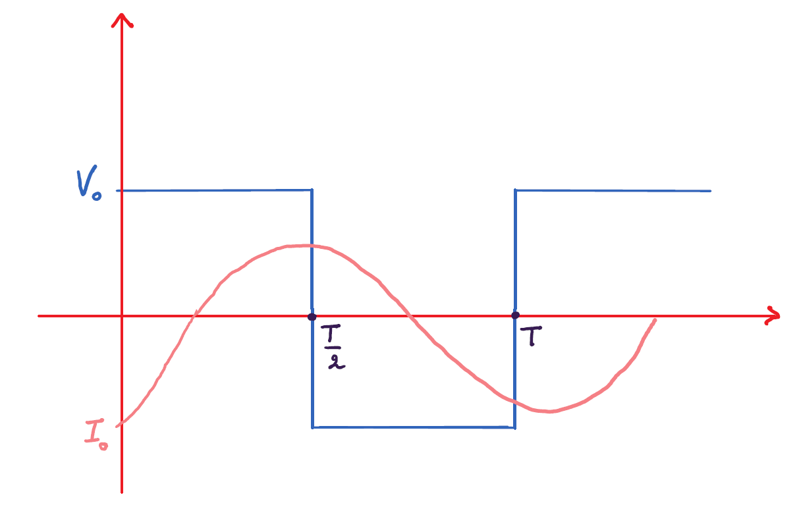
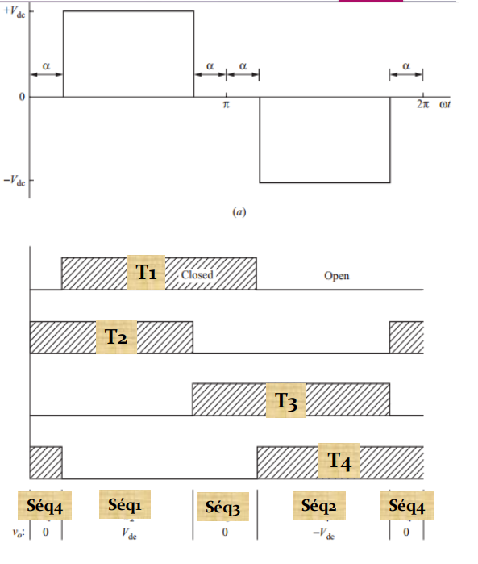
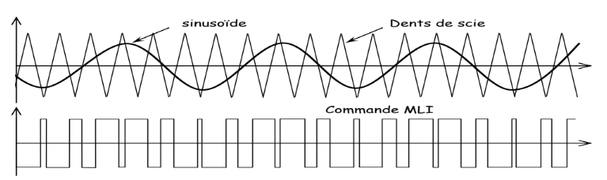

<h2>Project Description</h2>

  This practical work focuses on the study and analysis of the performance of
  two types of inverter configurations: <strong>single-phase and three-phase
  inverters</strong>. Several control techniques are investigated, including
  <strong>square-wave (full-wave) control, phase-shifted control, and Pulse
  Width Modulation (PWM)</strong>.

  The practical study examines the operation of these control methods and
  their influence on the characteristics and quality of the generated AC
  voltage.

<h2>Objectives</h2>

The main objectives of this practical work are to:

<ul>
  <li>
    Experimentally study the performance of
    <strong>three-phase inverters</strong> and their
    different modulation techniques.
  </li>
  <li>
    Understand the operating principles of the investigated control methods.
  </li>
  <li>
    Analyze their influence on the <strong>quality of the generated AC voltage</strong>.
  </li>
  <li>
    Evaluate the impact of the different modulation techniques on the overall
    <strong>performance of the inverter system</strong>.
  </li>
</ul>
<h2>Theoretical Background</h2>
<h3>Three-Phase Inverter Configuration</h3>

  The basic bridge structure consists of three legs. Each leg is composed of
  two switches that are reversible in both current and voltage:

  

<h3>Full-Wave Control</h3>

  In this technique, the switches <strong>(K1, K3)</strong> and
  <strong>(K2, K4)</strong> are controlled simultaneously to obtain
  sequences 1 and 2. The duration of each sequence is
  <strong>T/2</strong>.

  The output voltage <strong>vo</strong> is a waveform with a
  single pulse during each half-cycle.

  For an inductive load, the output current <strong>io</strong>
  varies between <strong>Imin</strong> and
  <strong>Imax</strong>.

  The RMS value of the output voltage is given by:
  

  \[
  V_{\mathrm{rms}} = V_{\mathrm{dc}}
  \]

  

For a square-wave output voltage, only odd harmonics are present.

<h4>Phase-Shifted Control</h4>

  In full-wave control, the RMS voltage across the load is constant and equal to
  <strong>Vdc</strong>. To regulate the output voltage, phase-shifted control is used.

  This control strategy introduces zero-voltage intervals across the load. The RMS value
  of the output voltage is given by:

  

  In particular, the <strong>amplitude of the fundamental frequency (n = 1)</strong>
  can be controlled by adjusting the <strong>phase-shift angle &alpha;</strong>.
  The harmonic content can also be controlled by adjusting the angle
  <strong>&alpha;</strong>.

<h3>Sinusoidal-Triangular PWM Control Techniques</h3>

  These control techniques are based on the <strong>comparison</strong> of a
  sinusoidal waveform, called the <strong>modulating wave</strong> or
  <strong>reference</strong>, with a high-frequency triangular waveform called
  the <strong>carrier</strong>.

  <strong>Pulse-width modulation (PWM)</strong> reduces the
  <strong>total harmonic distortion (THD)</strong> of the load current.
  Although the unfiltered PWM output voltage has a relatively high THD,
  its harmonics are shifted to much higher frequencies,
  <strong>making them easier to filter</strong>.

  

<h2> Experimental Setup</h2>
<table>
  <thead>
    <tr>
      <th>Equipment</th>
      <th>Image</th>
    </tr>
  </thead>
  <tbody>
    <tr>
      <td>DC Voltage Source</td>
      <td>
        
      </td>
    </tr>
    <tr>
      <td>Driver and Arduino Uno Board</td>
      <td>
        
      </td>
    </tr>
    <tr>
      <td>Inverter Setup</td>
      <td>
        
      </td>
    </tr>
    <tr>
      <td>RL Load</td>
      <td>
        
      </td>
    </tr>
    <tr>
      <td>Oscilloscope</td>
      <td>
        
      </td>
    </tr>
  </tbody>
</table>
